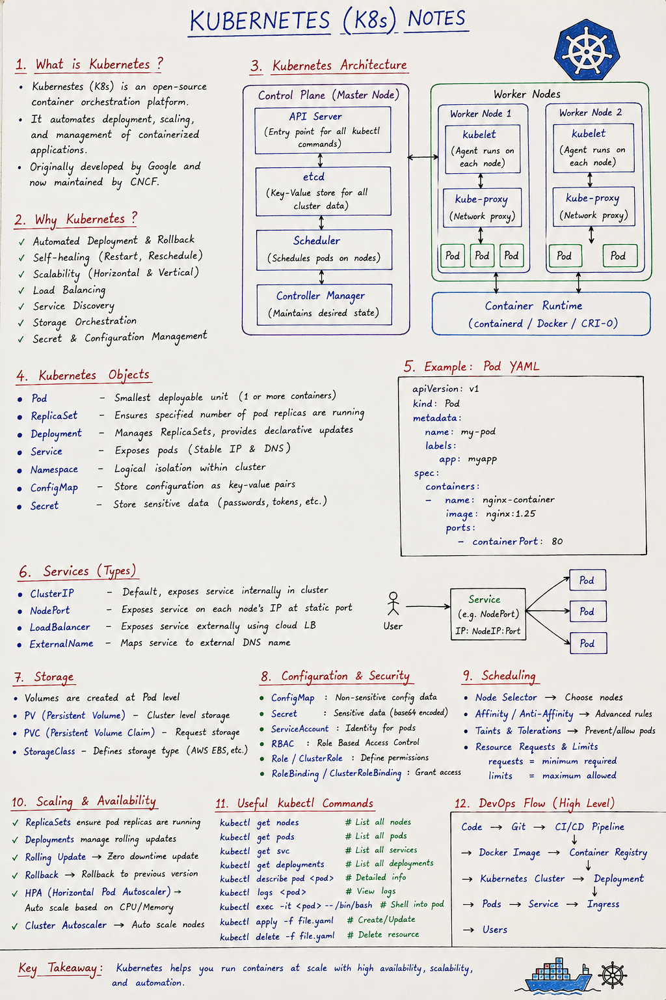
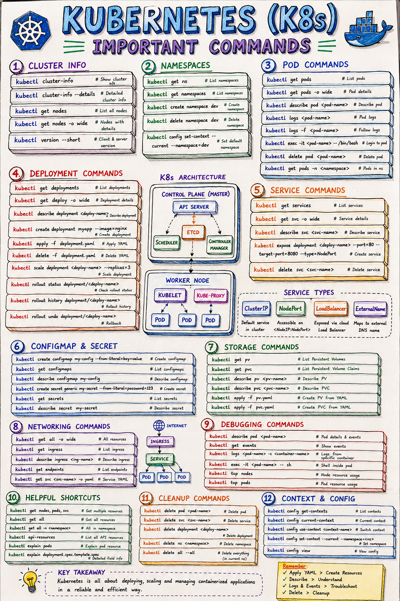
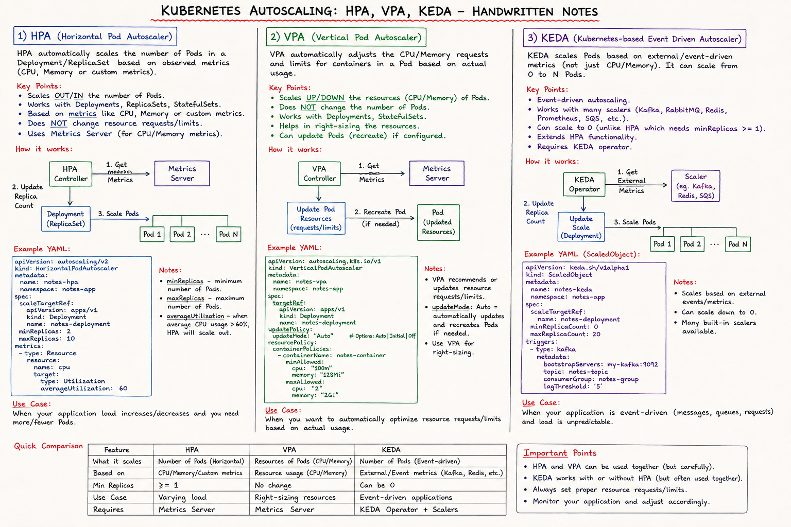

# k8s-practice

```
                 KUBERNETES CLUSTER
                        │
          ┌─────────────┴─────────────┐
          │                           │
     CONTROL PLANE                WORKER NODES
                                      │
                         ┌────────────┼────────────┐
                         │            │            │
                       Node 1       Node 2       Node 3
                         │            │            │
                       Pods         Pods         Pods
                         │            │            │
                         └────────────┼────────────┘
                                      │
                                Containers
                                      │
                                Application
                                      │
                                  Service
                                      │
                                   Users
```

- Node IP = where the machine is.
- Pod IP = where the application workload is inside the cluster.
- Service IP = stable address used to reach a group of Pods.

---


## k8s-cmds



Install the ingress-nginx controller:
```
kubectl apply -f https://raw.githubusercontent.com/kubernetes/ingress-nginx/main/deploy/static/provider/kind/deploy.yaml
```

Install the metrics-server (needed for HPA):
```
kubectl apply -f https://github.com/kubernetes-sigs/metrics-server/releases/latest/download/components.yaml
```

## HPA_VPA_KDA


